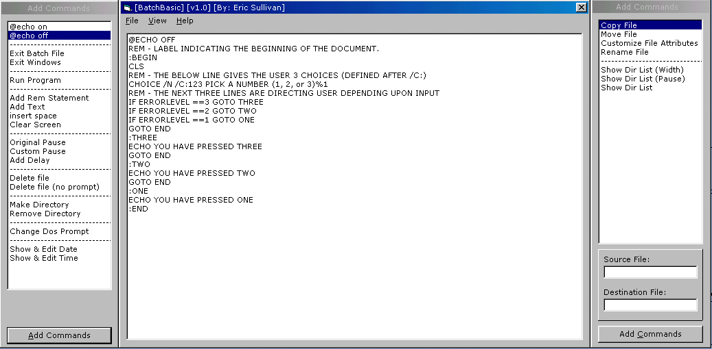



## BatchBasic v1\.0

### Description

This program will create batch files with the commands you choose. great program, easy to use.

Please rate this program and leave your comments
 
### More Info
 

             |
---                |---
**Submitted On**   |2000-06-09 16:03:46
**By**             |[Eric Sullivan](https://github.com/Planet-Source-Code/PSCIndex/blob/master/ByAuthor/eric-sullivan.md)
**Level**          |Beginner
**User Rating**    |4.9 (44 globes from 9 users)
**Compatibility**  |VB 5\.0, VB 6\.0
**Category**       |[Complete Applications](https://github.com/Planet-Source-Code/PSCIndex/blob/master/ByCategory/complete-applications__1-27.md)
**World**          |[Visual Basic](https://github.com/Planet-Source-Code/PSCIndex/blob/master/ByWorld/visual-basic.md)
**Archive File**   |[CODE\_UPLOAD6591692000\.zip](https://github.com/Planet-Source-Code/eric-sullivan-batchbasic-v1-0__1-8779/archive/master.zip)

